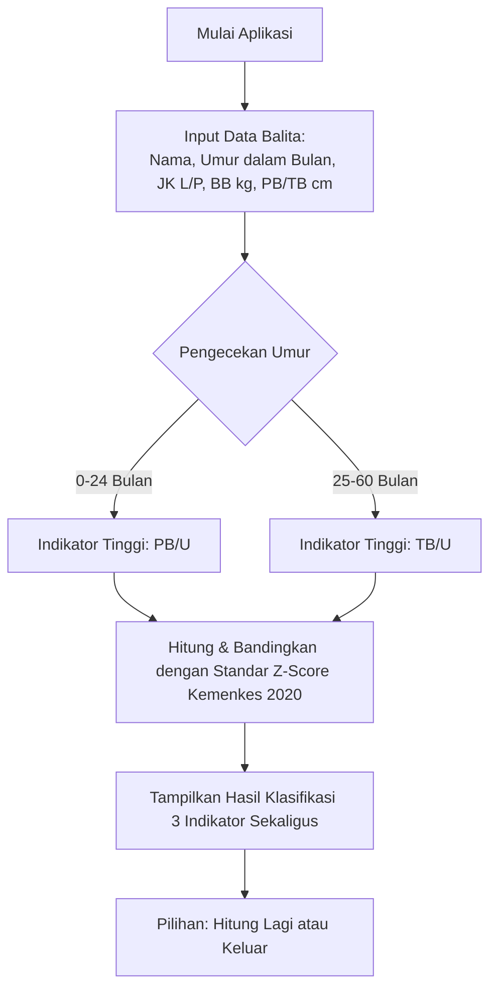

# Product Requirement Document (PRD)
## Sistem Deteksi Multi-Indikator Status Gizi Anak (Kalkulator Z-Score Antropometri)

| Informasi Proyek | Detail |
| --- | --- |
| **Nama Produk** | Kalkulator Antropometri Z-Score Anak |
| **Bahasa Pemrograman** | C++ (Aplikasi Console/CLI) |
| **Target Pengguna** | Kader Posyandu & Bidan Desa |
| **Standar Acuan** | Standar Antropometri Anak Kemenkes RI 2020 / WHO 2020 |
| **Status Dokumen** | Approved / Final Draft |

---

## 1. Latar Belakang & Masalah
Di fasilitas kesehatan tingkat dasar seperti Posyandu dan Klinik Desa, kader kesehatan dan bidan sering kali harus mengukur status gizi anak secara manual menggunakan buku panduan antropometri (Buku KIA) atau tabel Z-Score cetak. Proses ini:
1. **Memakan Waktu**: Harus mencari baris umur, jenis kelamin, dan membandingkan angka desimal satu per satu untuk 3 indikator berbeda.
2. **Rentan Kesalahan Manusia (*Human Error*)**: Salah membaca baris tabel atau salah menghitung selisih nilai median.
3. **Fragmentasi Data**: Kader harus menghitung BB/U, PB/U atau TB/U, dan BB/PB atau BB/TB secara terpisah yang memperlambat proses pendataan bulanan.

---

## 2. Deskripsi Produk & Nilai Jual
Aplikasi ini adalah **kalkulator medis cepat berbasis console (CLI)** interaktif. Cukup dengan **satu kali input data anak**, sistem akan langsung menghitung dan menampilkan klasifikasi untuk **3 indikator gizi sekaligus** secara instan:
1. **Berat Badan menurut Umur (BB/U)** untuk mendeteksi *Underweight* (Gizi Kurang/Buruk).
2. **Panjang Badan atau Tinggi Badan menurut Umur (PB/U atau TB/U)** untuk mendeteksi *Stunting* (Pendek/Kerdil).
3. **Berat Badan menurut Panjang Badan atau Tinggi Badan (BB/PB atau BB/TB)** untuk mendeteksi *Wasting* (Kurus/Sangat Kurus) hingga *Obesity* (Obesitas).

---

## 3. Target Pengguna & Persona
* **Kader Posyandu**: Petugas non-medis yang memerlukan alat bantu cepat, mudah dibaca, dan tidak membingungkan saat kegiatan posyandu bulanan.
* **Bidan Desa**: Tenaga medis profesional yang membutuhkan validasi cepat atas status pertumbuhan balita sebelum memberikan rujukan atau intervensi gizi.

---

## 4. Alur Pengguna (User Flow)

---

## 5. Persyaratan Fungsional (Functional Requirements)

### FR-1: Antarmuka Input Tunggal (One-Time Input)
* **Deskripsi**: Sistem meminta pengguna memasukkan data balita dalam satu alur teratur sebelum melakukan perhitungan.
* **Elemen Input**:
  * Nama Balita (String)
  * Umur (Integer, 0 - 60 Bulan)
  * Jenis Kelamin (Char: 'L'/'P' atau 'l'/'p')
  * Berat Badan (Float/Double, dalam kg)
  * Panjang/Tinggi Badan (Float/Double, dalam cm)

### FR-2: Klasifikasi Otomatis Indikator Tinggi/Panjang
* **Deskripsi**: Sistem harus mendeteksi secara otomatis apakah menggunakan **PB (Panjang Badan)** atau **TB (Tinggi Badan)** berdasarkan usia balita.
  * **0 - 24 bulan**: Menggunakan indikator **PB/U** dan **BB/PB**.
  * **25 - 60 bulan**: Menggunakan indikator **TB/U** Rumus dan standar tabel disesuaikan dengan posisi berdiri (**BB/TB**).

### FR-3: Mesin Hitung Z-Score (Z-Score Engine)
* **Deskripsi**: Sistem menghitung nilai Z-Score berdasarkan rumus standar:
  $$\text{Z-Score} = \frac{\text{Nilai Riil Anak} - \text{Nilai Median Standar}}{\text{Standard Deviation (SD)}}$$
  * *Catatan*: Jika Nilai Riil > Median, penyebut menggunakan $(SD_{1} = +1SD - Median)$. Jika Nilai Riil < Median, penyebut menggunakan $(SD_{-1} = Median - -1SD)$.
* **Data Referensi**: Database internal (berupa struktur data C++ seperti array atau map) yang berisi nilai standard deviasi (-3SD, -2SD, -1SD, Median, +1SD, +2SD, +3SD) untuk laki-laki dan perempuan usia 0-60 bulan.

### FR-4: Output Klasifikasi Komprehensif
Sistem harus menampilkan hasil analisis berupa tabel/ringkasan yang jelas dengan klasifikasi resmi Kemenkes:
1. **Indikator BB/U**:
   * Sangat Kurang (*Severely Underweight*): $< -3$ SD
   * Kurang (*Underweight*): $-3$ SD sampai $< -2$ SD
   * Normal: $-2$ SD sampai $+1$ SD
   * Risiko Berat Badan Lebih: $> +1$ SD
2. **Indikator PB/U atau TB/U**:
   * Sangat Pendek (*Severely Stunted*): $< -3$ SD
   * Pendek (*Stunted*): $-3$ SD sampai $< -2$ SD
   * Normal: $-2$ SD sampai $+2$ SD
   * Tinggi: $> +2$ SD
3. **Indikator BB/PB atau BB/TB**:
   * Gizi Buruk (*Severely Wasted*): $< -3$ SD
   * Gizi Kurang (*Wasted*): $-3$ SD sampai $< -2$ SD
   * Gizi Baik (Normal): $-2$ SD sampai $+1$ SD
   * Berisiko Gizi Lebih (*Risk of Overweight*): $> +1$ SD sampai $+2$ SD
   * Gizi Lebih (*Overweight*): $> +2$ SD sampai $+3$ SD
   * Obesitas (*Obese*): $> +3$ SD

---

## 6. Persyaratan Non-Fungsional (Non-Functional Requirements)
* **Portabilitas & Performa**: Aplikasi ditulis dalam C++ standar (C++11 atau lebih baru) agar dapat berjalan cepat dan ringan di komputer berspesifikasi rendah sekalipun (misal laptop kader/puskesmas tua).
* **Validasi Input**: 
  * Batasi input umur hanya dari 0 hingga 60 bulan.
  * Cegah input nilai negatif pada berat badan dan tinggi badan.
  * Validasi pilihan jenis kelamin agar tidak terjadi kegagalan kalkulasi.
* **Kemudahan Penggunaan (Usability)**: Tampilan visual console harus rapi, menggunakan pemisah garis yang jelas, dan penyorotan klasifikasi yang mudah dibaca.

---

## 7. Pengembangan Masa Depan (Future Roadmap)
* Menyimpan riwayat pemeriksaan ke dalam file eksternal (`.csv` atau `.txt`).
* Menambahkan fitur grafik tren perkembangan anak sederhana dalam format teks (ASCII Art).
* Ekspor laporan hasil deteksi kolektif per bulan untuk mempermudah pelaporan ke tingkat Puskesmas.
