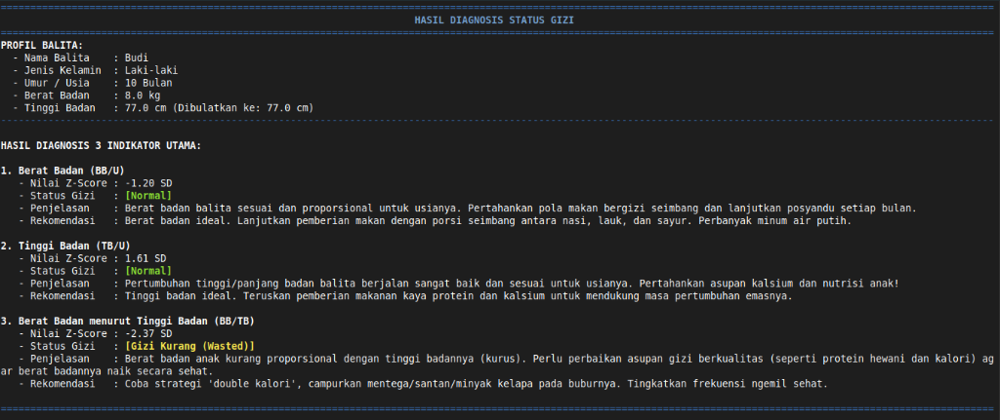

# Simulasi Kader Posyandu & Pemantauan Gizi Anak (C++)

Aplikasi berbasis *console* (CLI) interaktif yang dirancang sebagai simulasi sistem informasi Posyandu. Aplikasi ini mempermudah pencatatan data balita oleh Kader dan memberikan akses bagi Ibu Balita untuk memantau status gizi anak secara berkala.

Sistem ini mengintegrasikan perhitungan antropometri gizi berdasarkan **[Standar Antropometri Anak Kemenkes RI / WHO 2020](https://fs.stunting.go.id/index.php/s/bfZAQbcqDZo4ySo?_gl=1*1p290nc*_ga*OTgwMzIyNjY3LjE3NzkxMDczMzM.*_ga_TV21Y9HW17*czE3NzkxMTIwNzgkbzIkZzAkdDE3NzkxMTIwNzgkajYwJGwwJGgw#pdfviewer)**.

---

## 🚀 Fitur Utama

Berikut adalah daftar fitur lengkap yang tersedia pada aplikasi ini:

| No | Fitur Utama | Deskripsi Detail | Pengguna (Role) |
|---|---|---|---|
| 1 | **Sistem Akun & Multi-Role** | Aplikasi dilengkapi fitur Login dan Registrasi dengan dua jenis hak akses yang berbeda. | Kader Posyandu & Ibu Balita |
| 2 | **Manajemen Data Ibu Balita** | Mendaftarkan akun untuk Ibu Balita agar dapat memantau gizi anak secara mandiri. | Kader Posyandu |
| 3 | **Tambah Data Anak** | Menambahkan data balita dan menautkannya ke akun Ibu yang terdaftar. Fitur ini kini dilengkapi dengan pilihan daftar Ibu. | Kader Posyandu |
| 4 | **Pencatatan Pengukuran (Antropometri)**| Input data berat badan (BB), tinggi/panjang badan (TB/PB), dan umur balita setiap bulan. Terdapat validasi untuk mencegah input tidak wajar (contoh: nilai negatif). | Kader Posyandu |
| 5 | **Kalkulasi Z-Score Otomatis** | Sistem menghitung status gizi (BB/U, PB/U atau TB/U, dan BB/PB atau BB/TB) berdasarkan data rujukan standar Kemenkes RI/WHO secara instan. | Kader Posyandu & Ibu Balita |
| 6 | **Rekomendasi Asupan Gizi** | Menampilkan saran makanan dan nutrisi yang direkomendasikan berdasarkan hasil diagnosis Z-Score anak. | Kader Posyandu & Ibu Balita |
| 7 | **Rekam Jejak (History)** | Menyimpan dan menampilkan riwayat pengukuran sebelumnya secara urut, sehingga grafik pertumbuhan anak dapat dipantau dari waktu ke waktu. | Kader Posyandu & Ibu Balita |
| 8 | **Manajemen Data Relasional Berbasis File**| Semua data (pengguna, relasi ibu-anak, dan riwayat pengukuran) disimpan secara aman menggunakan sistem penyimpanan CSV. | Sistem |

---

## 🛠️ Persyaratan & Cara Menjalankan

Aplikasi ini dibuat menggunakan bahasa pemrograman C++. Anda memerlukan compiler C++ (seperti `g++`) untuk mengompilasi kode program ini.

### Kompilasi (Compile) & Instalasi
Jalankan script instalasi berikut di terminal Anda untuk mengompilasi program:
```bash
./install.sh
```

### Menjalankan Aplikasi (Run)
Setelah berhasil dikompilasi, jalankan program:
```bash
./antropometri_gizi_z_score
```

---

## 📊 Kriteria Klasifikasi (Standar Kemenkes RI 2020)

Hasil klasifikasi gizi yang dikeluarkan sistem meliputi:
* **BB/U**: Sangat Kurang, Kurang, Normal, Risiko Berat Badan Lebih.
* **PB/U atau TB/U**: Sangat Pendek, Pendek, Normal, Tinggi.
* **BB/PB atau BB/TB**: Gizi Buruk, Gizi Kurang, Gizi Baik (Normal), Berisiko Gizi Lebih, Gizi Lebih, Obesitas.
